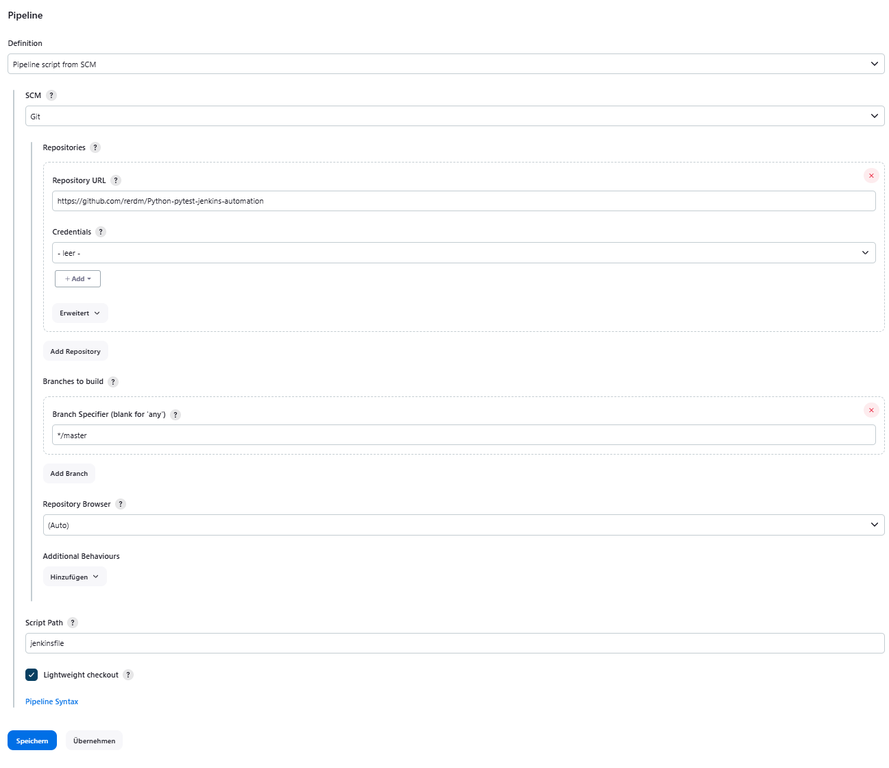
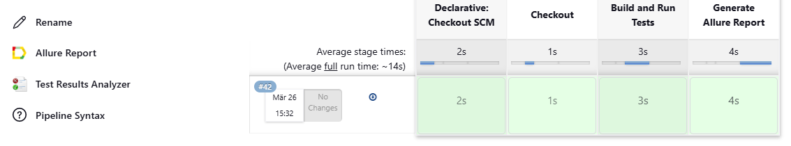
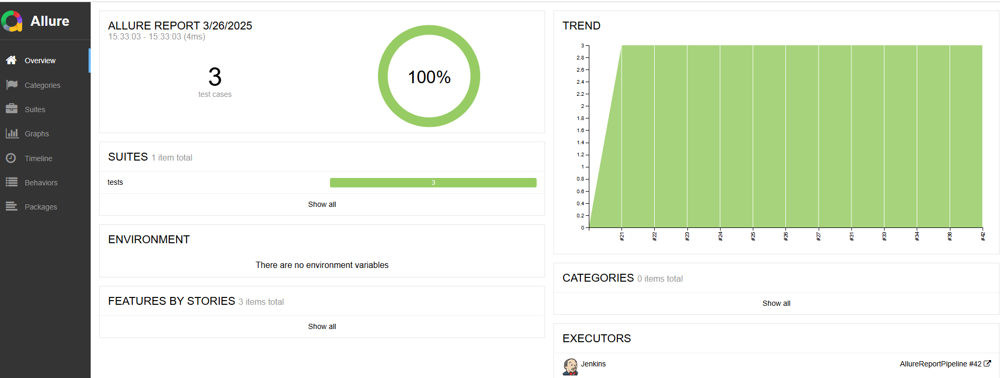

# Python-pytest-jenkins-automation

This project demonstrates a minimal testing pipeline using pytest for test execution, integrated with Jenkins for CI/CD, and enhanced with Allure Reports for visually rich test result reporting.<br> The Jenkinsfile (Pipeline script) is used to define the stages of the pipeline (uploaded in the root directory of the repository).

## Table of Contents
- [Preconditions](#preconditions)
- [GitHub](#github)
- [Jenkins](#jenkins)
- [Create Jenkins Job](#create-jenkins-job)
- [Run the Pipeline](#run-the-pipeline)

## Preconditions

- Python is installed - verify it with `python --version`.
- [Allure](https://repo.maven.apache.org/maven2/io/qameta/allure/allure-commandline/2.14.0/allure-commandline-2.14.0.zip) is installed - verify it with `allure --version`.
- Pytest is installed - verify it with `pytest --version`.
- [Jenkins](https://www.jenkins.io/doc/book/installing/windows/) is installed.
- Jenkins should run on [http://localhost:8080/](http://localhost:8080/).
- Install the following Jenkins plugins on the server:
    - Allure Jenkins Plugin
    - HTML Publisher Plugin
    - Pipeline Plugin
    - Git Plugin

## GitHub

- Create a GitHub repository with a basic pytest program. (Private repositories require additional authorization in Jenkins.)
- Create a [Jenkinsfile](Jenkinsfile) in the repository.

## Create Jenkins Job

- Create a Jenkins job (Pipeline Job): [http://localhost:8080/view/all/newJob](http://localhost:8080/view/all/newJob).
- Configure the job with `Pipeline Script from SCM` (the Jenkinsfile from GitHub will be used).

## Jenkins

- Create a Jenkins job.
- In this project, the Pipeline script (Jenkinsfile) is added to the root directory of the project.
- **Note:** You must set the exact path to your Jenkinsfile from the root directory of your repository.
- Ensure the name of the Jenkinsfile matches the name specified in the pipeline configuration.



## Run the Pipeline

You can view the execution results of the pipeline stages in the specific job:



The `Console output` can also be viewed for more detailed information:
<br>


```
Gestartet durch Benutzer Rene Erdmann
[Pipeline] Start of Pipeline
[Pipeline] node
Running on Jenkins in C:\ProgramData\Jenkins\.jenkins\workspace\AllureReportPipeline
[Pipeline] {
[Pipeline] tool
[Pipeline] withEnv
[Pipeline] {
[Pipeline] stage
[Pipeline] { (Checkout)
[Pipeline] checkout
The recommended git tool is: NONE
No credentials specified
 > git.exe rev-parse --resolve-git-dir C:\ProgramData\Jenkins\.jenkins\workspace\AllureReportPipeline\.git # timeout=10
Fetching changes from the remote Git repository
 > git.exe config remote.origin.url https://github.com/rerdm/Python-pytest-jenkins-automation.git # timeout=10
Fetching upstream changes from https://github.com/rerdm/Python-pytest-jenkins-automation.git
 > git.exe --version # timeout=10
 > git --version # 'git version 2.33.0.windows.2'
 > git.exe fetch --tags --force --progress -- https://github.com/rerdm/Python-pytest-jenkins-automation.git +refs/heads/*:refs/remotes/origin/* # timeout=10
 > git.exe rev-parse "refs/remotes/origin/master^{commit}" # timeout=10
Checking out Revision d8fecf32fa0f3ca5bc0072dcc44f500b2b3e7480 (refs/remotes/origin/master)
 > git.exe config core.sparsecheckout # timeout=10
 > git.exe checkout -f d8fecf32fa0f3ca5bc0072dcc44f500b2b3e7480 # timeout=10
Commit message: "initial update of project"
 > git.exe rev-list --no-walk a6331e5f0452fdd690cd0f68f6b4b0f0ce4d4f8a # timeout=10
[Pipeline] }
[Pipeline] // stage
[Pipeline] stage
[Pipeline] { (Build and Run Tests)
[Pipeline] script
[Pipeline] {
[Pipeline] bat

C:\ProgramData\Jenkins\.jenkins\workspace\AllureReportPipeline>pip install -r requirements.txt 
Requirement already satisfied: allure-pytest==2.13.2 in c:\users\renee\appdata\local\programs\python\python310\lib\site-packages (from -r requirements.txt (line 1)) (2.13.2)
Requirement already satisfied: allure-python-commons==2.13.2 in c:\users\renee\appdata\local\programs\python\python310\lib\site-packages (from -r requirements.txt (line 2)) (2.13.2)
Requirement already satisfied: async-generator==1.10 in c:\users\renee\appdata\local\programs\python\python310\lib\site-packages (from -r requirements.txt (line 3)) (1.10)
Requirement already satisfied: attrs==21.4.0 in c:\users\renee\appdata\local\programs\python\python310\lib\site-packages (from -r requirements.txt (line 4)) (21.4.0)
Requirement already satisfied: base-test==0.1 in c:\users\renee\appdata\local\programs\python\python310\lib\site-packages (from -r requirements.txt (line 5)) (0.1)
Requirement already satisfied: certifi==2021.10.8 in c:\users\renee\appdata\local\programs\python\python310\lib\site-packages (from -r requirements.txt (line 6)) (2021.10.8)
Requirement already satisfied: cffi==1.15.0 in c:\users\renee\appdata\local\programs\python\python310\lib\site-packages (from -r requirements.txt (line 7)) (1.15.0)
Requirement already satisfied: charset-normalizer==3.1.0 in c:\users\renee\appdata\local\programs\python\python310\lib\site-packages (from -r requirements.txt (line 8)) (3.1.0)
Requirement already satisfied: colorama==0.4.6 in c:\users\renee\appdata\local\programs\python\python310\lib\site-packages (from -r requirements.txt (line 9)) (0.4.6)
Requirement already satisfied: comtypes==1.2.0 in c:\users\renee\appdata\local\programs\python\python310\lib\site-packages (from -r requirements.txt (line 10)) (1.2.0)
Requirement already satisfied: cryptography==37.0.2 in c:\users\renee\appdata\local\programs\python\python310\lib\site-packages (from -r requirements.txt (line 11)) (37.0.2)
Requirement already satisfied: cycler==0.11.0 in c:\users\renee\appdata\local\programs\python\python310\lib\site-packages (from -r requirements.txt (line 12)) (0.11.0)
Requirement already satisfied: docx2python==2.0.4 in c:\users\renee\appdata\local\programs\python\python310\lib\site-packages (from -r requirements.txt (line 13)) (2.0.4)
Requirement already satisfied: et-xmlfile==1.1.0 in c:\users\renee\appdata\local\programs\python\python310\lib\site-packages (from -r requirements.txt (line 14)) (1.1.0)
Requirement already satisfied: exceptiongroup==1.1.1 in c:\users\renee\appdata\local\programs\python\python310\lib\site-packages (from -r requirements.txt (line 15)) (1.1.1)
Requirement already satisfied: fonttools==4.28.5 in c:\users\renee\appdata\local\programs\python\python310\lib\site-packages (from -r requirements.txt (line 16)) (4.28.5)
Requirement already satisfied: h11==0.13.0 in c:\users\renee\appdata\local\programs\python\python310\lib\site-packages (from -r requirements.txt (line 17)) (0.13.0)
Requirement already satisfied: idna==3.3 in c:\users\renee\appdata\local\programs\python\python310\lib\site-packages (from -r requirements.txt (line 18)) (3.3)
Requirement already satisfied: iniconfig==2.0.0 in c:\users\renee\appdata\local\programs\python\python310\lib\site-packages (from -r requirements.txt (line 19)) (2.0.0)
Requirement already satisfied: kiwisolver==1.3.2 in c:\users\renee\appdata\local\programs\python\python310\lib\site-packages (from -r requirements.txt (line 20)) (1.3.2)
Requirement already satisfied: lxml==4.9.1 in c:\users\renee\appdata\local\programs\python\python310\lib\site-packages (from -r requirements.txt (line 21)) (4.9.1)
Requirement already satisfied: matplotlib==3.5.1 in c:\users\renee\appdata\local\programs\python\python310\lib\site-packages (from -r requirements.txt (line 22)) (3.5.1)
Requirement already satisfied: numpy==1.22.1 in c:\users\renee\appdata\local\programs\python\python310\lib\site-packages (from -r requirements.txt (line 23)) (1.22.1)
Requirement already satisfied: openpyxl==3.0.9 in c:\users\renee\appdata\local\programs\python\python310\lib\site-packages (from -r requirements.txt (line 24)) (3.0.9)
Requirement already satisfied: outcome==1.1.0 in c:\users\renee\appdata\local\programs\python\python310\lib\site-packages (from -r requirements.txt (line 25)) (1.1.0)
Requirement already satisfied: packaging==21.3 in c:\users\renee\appdata\local\programs\python\python310\lib\site-packages (from -r requirements.txt (line 26)) (21.3)
Requirement already satisfied: Pillow==9.0.0 in c:\users\renee\appdata\local\programs\python\python310\lib\site-packages (from -r requirements.txt (line 27)) (9.0.0)
Requirement already satisfied: pluggy==1.0.0 in c:\users\renee\appdata\local\programs\python\python310\lib\site-packages (from -r requirements.txt (line 28)) (1.0.0)
Requirement already satisfied: py==1.11.0 in c:\users\renee\appdata\local\programs\python\python310\lib\site-packages (from -r requirements.txt (line 29)) (1.11.0)
Requirement already satisfied: pycparser==2.21 in c:\users\renee\appdata\local\programs\python\python310\lib\site-packages (from -r requirements.txt (line 30)) (2.21)
Requirement already satisfied: pyOpenSSL==22.0.0 in c:\users\renee\appdata\local\programs\python\python310\lib\site-packages (from -r requirements.txt (line 31)) (22.0.0)
Requirement already satisfied: pyparsing==3.0.7 in c:\users\renee\appdata\local\programs\python\python310\lib\site-packages (from -r requirements.txt (line 32)) (3.0.7)
Requirement already satisfied: PySocks==1.7.1 in c:\users\renee\appdata\local\programs\python\python310\lib\site-packages (from -r requirements.txt (line 33)) (1.7.1)
Requirement already satisfied: pytest==7.3.1 in c:\users\renee\appdata\local\programs\python\python310\lib\site-packages (from -r requirements.txt (line 34)) (7.3.1)
Requirement already satisfied: pytest-html==3.2.0 in c:\users\renee\appdata\local\programs\python\python310\lib\site-packages (from -r requirements.txt (line 35)) (3.2.0)
Requirement already satisfied: pytest-metadata==3.0.0 in c:\users\renee\appdata\local\programs\python\python310\lib\site-packages (from -r requirements.txt (line 36)) (3.0.0)
Requirement already satisfied: python-dateutil==2.8.2 in c:\users\renee\appdata\local\programs\python\python310\lib\site-packages (from -r requirements.txt (line 37)) (2.8.2)
Requirement already satisfied: python-dotenv==1.0.0 in c:\users\renee\appdata\local\programs\python\python310\lib\site-packages (from -r requirements.txt (line 38)) (1.0.0)
Requirement already satisfied: pywin32==306 in c:\users\renee\appdata\local\programs\python\python310\lib\site-packages (from -r requirements.txt (line 39)) (306)
Requirement already satisfied: pywinauto==0.6.8 in c:\users\renee\appdata\local\programs\python\python310\lib\site-packages (from -r requirements.txt (line 40)) (0.6.8)
Requirement already satisfied: requests==2.31.0 in c:\users\renee\appdata\local\programs\python\python310\lib\site-packages (from -r requirements.txt (line 41)) (2.31.0)
Requirement already satisfied: selenium==4.1.5 in c:\users\renee\appdata\local\programs\python\python310\lib\site-packages (from -r requirements.txt (line 42)) (4.1.5)
Requirement already satisfied: six==1.16.0 in c:\users\renee\appdata\local\programs\python\python310\lib\site-packages (from -r requirements.txt (line 43)) (1.16.0)
Requirement already satisfied: sniffio==1.2.0 in c:\users\renee\appdata\local\programs\python\python310\lib\site-packages (from -r requirements.txt (line 44)) (1.2.0)
Requirement already satisfied: sortedcontainers==2.4.0 in c:\users\renee\appdata\local\programs\python\python310\lib\site-packages (from -r requirements.txt (line 45)) (2.4.0)
Requirement already satisfied: tomli==2.0.1 in c:\users\renee\appdata\local\programs\python\python310\lib\site-packages (from -r requirements.txt (line 46)) (2.0.1)
Requirement already satisfied: trio==0.20.0 in c:\users\renee\appdata\local\programs\python\python310\lib\site-packages (from -r requirements.txt (line 47)) (0.20.0)
Requirement already satisfied: trio-websocket==0.9.2 in c:\users\renee\appdata\local\programs\python\python310\lib\site-packages (from -r requirements.txt (line 48)) (0.9.2)
Requirement already satisfied: urllib3==1.26.9 in c:\users\renee\appdata\local\programs\python\python310\lib\site-packages (from -r requirements.txt (line 49)) (1.26.9)
Requirement already satisfied: webdriver-manager==4.0.1 in c:\users\renee\appdata\local\programs\python\python310\lib\site-packages (from -r requirements.txt (line 50)) (4.0.1)
Requirement already satisfied: wsproto==1.1.0 in c:\users\renee\appdata\local\programs\python\python310\lib\site-packages (from -r requirements.txt (line 51)) (1.1.0)

[notice] A new release of pip is available: 23.3.2 -> 25.0.1
[notice] To update, run: python.exe -m pip install --upgrade pip
[Pipeline] bat

C:\ProgramData\Jenkins\.jenkins\workspace\AllureReportPipeline>pytest tests/test_calculate.py --html=reports/reports.html --alluredir=target/allure-results --junitxml=reports/junit.xml 
============================= test session starts =============================
platform win32 -- Python 3.10.1, pytest-7.3.1, pluggy-1.0.0
rootdir: C:\ProgramData\Jenkins\.jenkins\workspace\AllureReportPipeline
plugins: allure-pytest-2.13.2, html-3.2.0, metadata-3.0.0
collected 3 items

tests\test_calculate.py ...                                              [100%]

- generated xml file: C:\ProgramData\Jenkins\.jenkins\workspace\AllureReportPipeline\reports\junit.xml -
- generated html file: file:///C:/ProgramData/Jenkins/.jenkins/workspace/AllureReportPipeline/reports/reports.html -
============================== 3 passed in 0.04s ==============================
[Pipeline] }
[Pipeline] // script
[Pipeline] }
[Pipeline] // stage
[Pipeline] stage
[Pipeline] { (Generate Allure Report)
[Pipeline] script
[Pipeline] {
[Pipeline] allure
[AllureReportPipeline] $ C:\ProgramData\Jenkins\.jenkins\tools\ru.yandex.qatools.allure.jenkins.tools.AllureCommandlineInstallation\allure-commandline\bin\allure.bat generate C:\ProgramData\Jenkins\.jenkins\workspace\AllureReportPipeline\target\allure-results -c -o C:\ProgramData\Jenkins\.jenkins\workspace\AllureReportPipeline\allure-report
Report successfully generated to C:\ProgramData\Jenkins\.jenkins\workspace\AllureReportPipeline\allure-report
Allure report was successfully generated.
Creating artifact for the build.
Artifact was added to the build.
[Pipeline] }
[Pipeline] // script
[Pipeline] }
[Pipeline] // stage
[Pipeline] stage
[Pipeline] { (Generate HTMl Report)
[Pipeline] script
[Pipeline] {
[Pipeline] publishHTML
[htmlpublisher] Archiving HTML reports...
[htmlpublisher] Archiving at PROJECT level C:\ProgramData\Jenkins\.jenkins\workspace\AllureReportPipeline\reports to C:\ProgramData\Jenkins\.jenkins\jobs\AllureReportPipeline\htmlreports\HTML_20Report
[Pipeline] }
[Pipeline] // script
[Pipeline] }
[Pipeline] // stage
[Pipeline] }
[Pipeline] // withEnv
[Pipeline] }
[Pipeline] // node
[Pipeline] End of Pipeline
Finished: SUCCESS
```

## Generated Allure Report

- After the execution the report can be accessed via the allure button.<br>
<br>

<br>
<br>

- The allure report shows the details from the test(s) execution <br>
<br>




